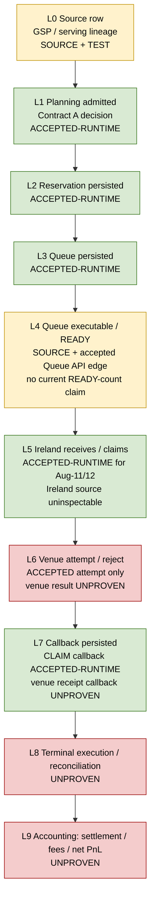

# Versioned graph control layer

**Repository / baseline:** `POLYPROPICKS/PREMVP`, `origin/main` `4a4165d6643b10a705cc8e14e44e20cb74aa7610` (2026-08-24). This is a source-backed control map, not a runtime command or a replacement for `CURRENT_STATE.yaml`.

## Tooling and evidence status

| Layer | Actual status | Evidence contract |
| --- | --- | --- |
| CodeGraph | `AVAILABLE_AND_REFRESHED` | `codegraph init` indexed 413 files / 6,449 nodes / 22,352 edges against the baseline; its local `.codegraph/` index is intentionally uncommitted. |
| Graphify | `UNAVAILABLE_OR_UNBOUND` | No executable, dependency, repository config, or canonical control-plane binding exists. No package was installed or result fabricated. |
| Mermaid | `COMMITTED` | The three graphs below are the portable, versioned human map. |

### Evidence labels

`SOURCE` means the named PREMVP function/route exists. `TEST` means the canonical spine records contract-test evidence. `ACCEPTED-RUNTIME` means the accepted Aug-11/12 checkpoint recorded in `CANONICAL_VERTICAL_SPINE_MANIFEST.yaml`; it is not a fresh live read in this mission. `UNPROVEN` means no venue/result evidence was asserted.

`CURRENT_STATE.yaml` was last updated 2026-08-13 and declares baseline `280d35bd…`; current `origin/main` is newer and includes source/runtime changes. This map records that contradiction; it does **not** self-accept a state rewrite. **State-delta proposal:** reconcile `CURRENT_STATE.yaml` in its own accepted control-plane run, using this document only as supporting source/evidence indexing.

## Graph 1 — end-to-end authority spine

```mermaid
flowchart LR
  PM[Polymarket\nprovider universe\nSOURCE: discoverSportsMarkets] --> GSP[generated_signal_pairs\nhistory + exact lineage id\nSOURCE: writeGeneratedSignalPairs]
  GSP --> HOT[current_signal_pair_serving\nhot current authority\nSOURCE: projectInsertedRows -> refresh RPC]
  HOT --> FM[FireModel1.1 resolver/scoring\nSCORE AUTHORITY\nSOURCE: buildFireModelCandidates]
  FM --> CA[CONTRACT_A_PLANNING_V1\nPOLICY/RANKING AUTHORITY\nSOURCE: produceContractAPlanningDecisions]
  CA --> RES[Reservation\nPHYSICAL-EVENT AUTHORITY\nnight_event_reservations]
  RES --> REB[Rebalance\nEXACT MECHANICAL IDENTITY\nrunEventRebalance]
  REB --> Q[Immutable Queue\nEXECUTION INSTRUCTION AUTHORITY\nevent_execution_queue]
  Q --> API[PREMVP Queue adapter\nGET /api/executor/queue]
  API --> IE[Ireland boundary\nEXECUTION ONLY — NO RERANKING]
  IE --> CLAIM[claim-before-submit\nPOST /api/executor/queue/mark\nREADY -> CLAIMED CAS]
  CLAIM --> CLOB[Polymarket CLOB venue\nIreland-owned adapter]
  CLOB --> CB[callback / reconciliation\nPOST /api/executor/order-events]
  CB --> PNL[settlement -> fees -> net PnL]

  classDef accepted fill:#d9ead3,stroke:#38761d,color:#000;
  classDef source fill:#fff2cc,stroke:#bf9000,color:#000;
  classDef unknown fill:#f4cccc,stroke:#990000,color:#000;
  class PM,GSP,HOT,FM source;
  class CA,RES,REB,Q,API,IE,CLAIM accepted;
  class CLOB,CB,PNL unknown;
```

Source edge index: `discoverSportsMarkets()` → `writeGeneratedSignalPairs()` (`lib/feed/discoverSportsMarkets.ts`, `lib/feed/cacheGeneratedSignals.ts`) → `projectInsertedRows()` / `refreshCurrentSignalPairServing()` (`lib/feed/currentSignalPairServing.ts`) → `buildFireModelCandidates()` (`lib/executor/buildFireModelCandidates.ts`) → `produceContractAPlanningDecisions()` (`lib/executor/contractADecisions.ts`) → `persistReservationPlan()` (`lib/executor/nightEventReservations.ts`) → `runEventRebalance()` / queue insert (`lib/executor/eventExecutionQueue.ts`) → Queue GET / mark / order-event routes (`app/api/executor/**`). The Queue contract preserves `condition_id`, `token_id`, `side`, `idempotency_key`, cap, and `queue_row_id`; see `CROSS_SYSTEM_CONTRACT_MATRIX.yaml`.

## Graph 2 — runtime acceptance ladder

The deepest accepted vertical edge is Ireland entering `SENDING` and attempting submission; the venue cause/result, receipt persistence, terminal `EXECUTED`, settlement, fees, and PnL remain unproven. This corrects the older “awaiting today’s first L4–L6 proof” expectation without downgrading the accepted Aug-11/12 checkpoint or upgrading it to fresh live evidence.

## Graph 3 — current live funnel / control map

```mermaid
flowchart LR
  U[Provider / source observation\n500 raw last-24h rows\n2026-08-24T13:15:32Z] --> F[FireModel observations\n90 standard candidates\n0 BET_OR_PAPER_GO within 2h\n2026-08-24T13:15:34Z]
  F --> A[Contract A / 17:00 Minsk anchor\nsource policy: target 15 slots]
  A --> R[Reservation window\nCURRENT COUNT: UNAVAILABLE\nnot inferred]
  R --> B[Rebalance\nT-70..T-3 source gate]
  B --> Q2[Queue\nfixed execution cap USD 1.10\nnot USD 1.50]
  Q2 --> I[One Ireland consumer\naccepted prior SENDING attempt\nno fresh supervisor/CLOB-auth probe]
  I --> V[Venue receipts\nPENDING / UNPROVEN]

  classDef observation fill:#cfe2f3,stroke:#1155cc,color:#000;
  classDef policy fill:#fff2cc,stroke:#bf9000,color:#000;
  classDef pending fill:#f4cccc,stroke:#990000,color:#000;
  class U,F observation;
  class A,B,Q2 policy;
  class R,I,V pending;
```

Bounded observations are deliberately non-equivalent: `npm run firemodel1:funnel` reported 500 raw 24-hour rows but only one allowed-version/final-valid row; `npm run firemodel1:live-readiness` built a 90-candidate standard pool but no `BET_OR_PAPER_GO` candidate within two hours. They are recorded with their runner and timestamp, not collapsed into a provider-universe or Reservation claim. No production HTTPS, Queue endpoint, Ireland host, venue, secret, scheduler, or database write occurred.

## Deferred — visible, not blockers for this map

- PostgREST / Planning 1,000-row contract cleanup.
- Serving-prune convergence.
- 10K-to-1K capacity proof.
- Rebalance N+1 materiality.
- Research/model-governance changes.
- Historical Queue cleanup.
- Full settlement, fees, and reconciled net-PnL completion.

## Independent challenge record

### PROVEN_FACTS

- CodeGraph is installed and indexed the current clean `origin/main` baseline.
- Graphify has no current executable or binding in this repository/environment.
- The source owns the execution stake as `EXECUTABLE_STAKE_USD = 1.1`; Queue claim is compare-and-set from `READY` to `CLAIMED`.
- The canonical spine records accepted-runtime edges through Ireland’s SENDING/venue-attempt boundary and records the venue result as unproven.

### SUPPORTED_INFERENCES

- Mermaid is the smallest portable committed layer; the local CodeGraph index should remain generated/uncommitted.

### UNVERIFIED_ASSUMPTIONS

- Current Reservation count, current Queue READY count, single-supervisor state, authenticated CLOB connectivity, and venue receipt state were not re-probed here.

### CONTRADICTIONS

- `CURRENT_STATE.yaml` is stale against current `origin/main`.
- The historical USD 1.50 ceiling differs from current source’s fixed USD 1.10 execution cap.
- The two current read-only candidate runners report different universes; they are not interchangeable measurements.

### FIRST_PROVEN_PROBLEM

The first constraint is evidence-label ambiguity: source, accepted runtime, and unproven venue evidence were being conflated by an unversioned narrative.

### SMALLEST_DEFENSIBLE_APPROACH

Commit this one source-annotated Mermaid control document; change no product/runtime behavior and leave state reconciliation separate.

### MATERIAL_ALTERNATIVE

NONE.

### REGRESSION_AND_MAINTENANCE_RISK

Documentation can become stale; the baseline SHA, timestamps, explicit labels, and source-edge index make that visible without creating a second runtime authority.

**Verdict: `PROCEED_WITH_CORRECTION`.**
